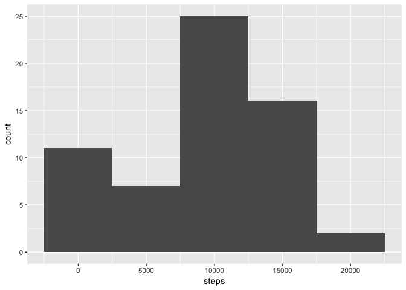
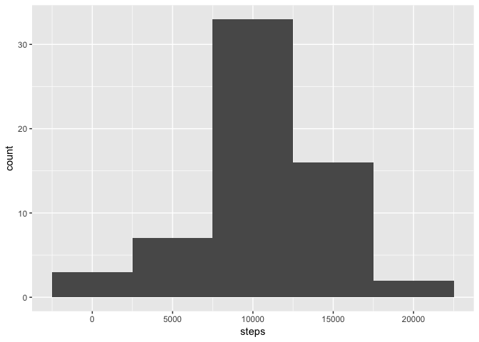
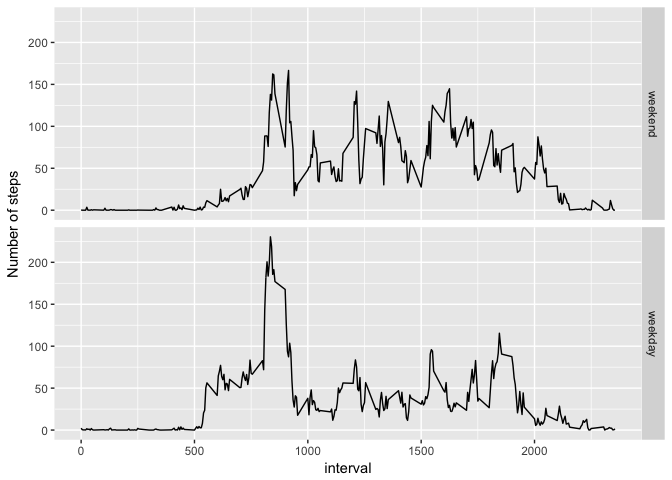

# Reproducible Research: Peer Assessment 1


```r
library(dplyr)
```

```
## 
## Attaching package: 'dplyr'
```

```
## The following objects are masked from 'package:stats':
## 
##     filter, lag
```

```
## The following objects are masked from 'package:base':
## 
##     intersect, setdiff, setequal, union
```

```r
library(ggplot2)
library(lubridate)
```

```
## 
## Attaching package: 'lubridate'
```

```
## The following object is masked from 'package:base':
## 
##     date
```


```r
activity <- read.csv('activity.csv')
```

##What is mean total number of steps taken per day?
Steps per day

```r
sum_steps_per_day <- activity %>% 
  group_by(date) %>% 
  summarise(steps = sum(steps, na.rm =TRUE))
```


```r
ggplot(data=sum_steps_per_day, aes(steps)) + geom_histogram(binwidth = 5000)
```

<!-- -->

Mean

```r
mean(sum_steps_per_day$steps, na.rm = TRUE)
```

```
## [1] 9354.23
```

Median

```r
median(sum_steps_per_day$steps, na.rm = TRUE)
```

```
## [1] 10395
```


```r
mean_steps_by_interval <- activity %>% 
  group_by(interval) %>% 
  summarise(steps = mean(steps, na.rm =TRUE))

ggplot(data=mean_steps_by_interval, aes(x=interval, y=steps)) +
    geom_line() 
```

<!-- -->

Interval with the maximum number of steps is

```r
row_with_highest_mean_step <- which.max(mean_steps_by_interval$steps)


mean_steps_by_interval[row_with_highest_mean_step,]
```

```
## # A tibble: 1 x 2
##   interval    steps
##      <int>    <dbl>
## 1      835 206.1698
```

##Imputing missing values

Number of rows with missing values

```r
sum(!complete.cases(activity)) 
```

```
## [1] 2304
```

Imputing missing values with the mean for the interval that is missing, for example if interval 5 is NA it will get replaced with the mean for interval 5

```r
imputed_activity <- mutate(activity, steps = ifelse(is.na(activity$steps), mean_steps_by_interval$steps[match(activity$interval, mean_steps_by_interval$interval)], activity$steps))
```
Mean


```r
sum_steps_per_day_imputed <- imputed_activity %>% 
  group_by(date) %>% 
  summarise(steps = sum(steps, na.rm =TRUE))

ggplot(data=sum_steps_per_day_imputed, aes(steps)) + geom_histogram(binwidth = 5000)
```

<!-- -->
Mean

```r
mean(sum_steps_per_day_imputed$steps)
```

```
## [1] 10766.19
```
Median

```r
median(sum_steps_per_day_imputed$steps)
```

```
## [1] 10766.19
```

###Result
The new mean and median for the data is very similar to the old values before imputing data. 

##Are there differences in activity patterns between weekdays and weekends?

```r
imputed_activity$date <- ymd(imputed_activity$date)
weekendnames <- c('Saturday', 'Sunday')

#Create new column with dayType set to weekend or weekday depending on #day
imputed_activity$dayType <- factor((weekdays(imputed_activity$date) %in% weekendnames), levels = c(TRUE, FALSE), labels=c('weekend', 'weekday'))

mean_interval_by_daytype <- imputed_activity %>% 
  group_by(interval, dayType) %>% 
  summarise(steps = mean(steps))

ggplot(data=mean_interval_by_daytype, aes(x=interval, y=steps, group=dayType)) +
    geom_line() +
    ylab('Number of steps')+
    facet_grid(dayType ~ .)
```

<!-- -->

